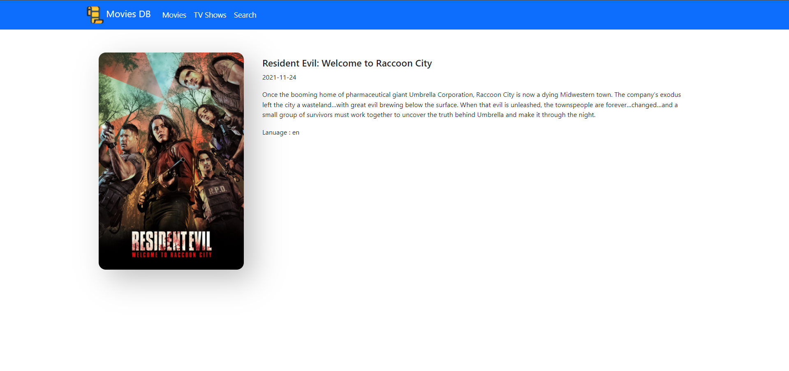
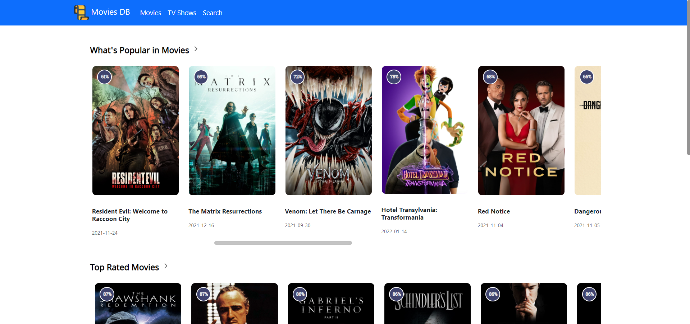

### React Movies-DB
A simple web app that show details and lists movies, created with React.js

This web app uses <a href="https://www.themoviedb.org/">TheMovieDB</a> API to get data.

#### Install
```
git clone https://github.com/nisabmohd/movies-react/.git
```

#### Install all the required dependencies using
```
npm i
```
#### Launch the App
```
npm start
```

#### Screenshots



<br/>


